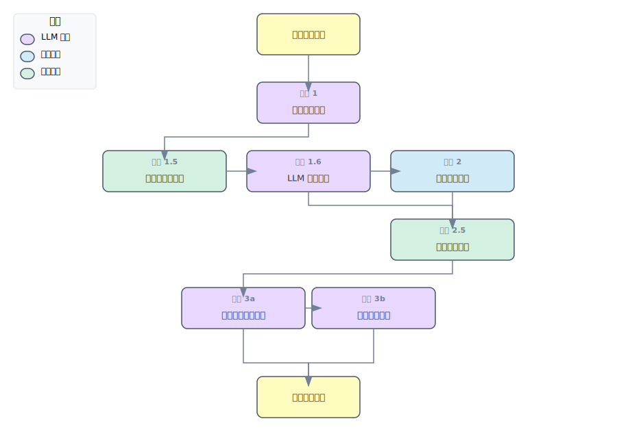

# risk-analyse-RAG-system
# 项目描述
该项目是一个由多模态大模型驱动的自动化解决方案，旨在从现场图像中实时识别工业安全风险，并自动检索、关联相关的风险描述，最终生成专业的风险分析报告和管控措施。
# 项目概览（RAG部分）

# 部署指南

## 1.环境配置

```
conda create -n flash python=3.10
```

```
conda activate flash
#下载transformer库，解压，安装，在transformer目录下执行 #https://github.com/huggingface/transformers/tree/7a25f8dfdba4c710d278d8312ef2522c5996a894
pip install -e .
```

```
pip install gradio==5.4.0 gradio_client==1.4.2 qwen-vl-utils==0.0.10 transformers-stream-generator==0.0.4  accelerate av
```

```
pip install torch==2.6.0 torchvision==0.21.0 torchaudio==2.6.0 --index-url https://download.pytorch.org/whl/cu124
```

```
pip install flash-attn==2.6.1 --no-build-isolation
```

```
pip install -i https://pypi.tuna.tsinghua.edu.cn/simple langchain langchain_community langchain_core sentence-transformers faiss-cpu pypdf fastapi uvicorn python-multipart Pillow
pip install --upgrade autoawq
pip install chardet openpyxl
```

## 2.下载模型

```
pip install modelscope
modelscope download --model Qwen/Qwen2.5-VL-32B-Instruct-AWQ
modelscope download --model AI-ModelScope/bge-base-zh-v1.5
```

## 3.创建知识库索引

将《风险源清单.xlsx》文件上传到服务器目录kb_risk

```
#创建向量数据库
python vector1.py
```

这会在指定的 VECTOR_STORE_PATH 生成 FAISS 索引文件。

## 4.运行RAG脚本

将“风险源列表_清洗后.txt”上传至服务器

```
python qwen_32b_flash.py
```


## 5.测试

将测试图片上传至服务器

```
bash analyze_images.sh
```

格式优化

```
python format_risk_json.py
```

输出为doc文档

```
python generate_doc_with_images.py
```

## 6.样例
描述:
# 图片内容概述：
- 核心设备：图中主要展示了一台标有“斯大锅炉”的冷凝余热回收蒸汽锅炉。该设备呈蓝色箱体结构，顶部装有多组压力表和其他仪表装置，用于监测运行状态。
- 周围环境及设施：
- 设备位于室内厂房环境中，地面平整但略显磨损痕迹。
- 周围安装了多根管道和支架，部分区域涂有黄色油漆标识，可能作为安全警示标记。
- 工作区域内还放置了一个小型控制柜，配备触摸屏界面和多个指示灯/按钮，可能是用于监控和调节锅炉系统参数的操作终端。
- 锅炉左侧连接着燃气阀门组件，右侧则有一个圆形风机或其他配套机械部件，表明这是一个完整的供热或能源管理系统的一部分。
- 后方背景处可以看到一扇窗户透入自然光线，墙壁上有明显的使用痕迹，显示出工厂的实际工作场景特征。
- 总体状况：整体布局紧凑且功能分区明确，各组成部分通过管线紧密相连，体现了典型的工业化生产环境特点。未见明显杂物堆积或异常现象，显示现场管理较为有序。

# 风险分析:
```
识别出的风险源
蒸汽锅炉、阀门
综合风险描述
-   关于蒸汽锅炉:
1. 锅炉及其管道的高温表面和高温介质可能导致灼烫事故。（依据：序号3250，瓶装工业气经营企业）。
2. 可燃气体在输送过程中可能发生泄漏，并与空气混合形成爆炸性混合物，接触点火源引发爆炸事故。（依据：序号9184，承压蒸汽锅炉）。
3. 设备受压元件强度不足或因严重缺水等原因，可能会导致锅炉爆炸。（依据：序号9184，承压蒸汽锅炉）。
4. 安全附件如安全阀、压力表等失效，可能导致锅炉超压而爆炸。（依据：序号2674，星级饭店）。
5. 在维修或检查中若未能确保系统的完全隔离，可能存在汽水喷射危险，进而对工作人员造成烫伤威胁。（依据：序号1320，发电企业）。
-   关于阀门:
1. 若阀门出现故障或磨损，可能导致蒸汽泄露并引发灼烫事故。（依据：序号4022，建材行业企业）。
2. 如果阀门密封不良，可能出现燃气泄漏问题，从而增加火灾、爆炸以及中毒的风险。（依据：序号1478，供热企业）。
3. 当涉及电气部分的操作不当，还存在触电的安全隐患。（依据：序号329，工业企业）。
风险类型
灼烫风险, 爆炸风险, 泄露风险, 触电风险, 运行失控风险
```
# 综合管理措施
-   针对蒸汽锅炉：
1. 对所有高压部件定期进行无损检测（NDT），包括但不限于焊缝、受热面管子及法兰连接处，以评估其结构完整性；同时建立详细的设备档案记录每次检验结果。
2. 实现自动化监控系统升级，在锅炉运行时实时监测温度、压力参数变化趋势，并配备声光报警装置以便及时发现异常情况；此外设置多重联锁保护机制防止人为误操引起过载现象发生。
-   针对阀门：
1. 建立严格的维护保养计划，每季度拆解重点部位的关键阀门进行全面清洗润滑处理后重新组装调试确认功能完好率达标后再投入使用；
2. 引入在线状态监测技术手段持续跟踪重要位置上的动态性能表现状况如有偏差则迅速采取补救行动比如更换备件或者调整工艺流程等方式降低潜在危害发生的概率 。
